# 新机装配指南

## 一、硬件组装

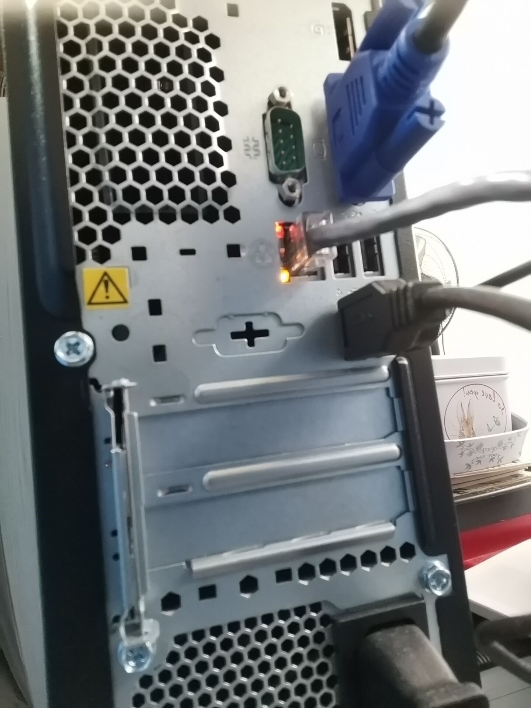

## 二、IP地址申请-目前IP地址紧缺需要试探性查找可用IP地址

查看“立华IP地址信息.xlsx”文档，确定大概空缺的IP地址，比如：192.168.2.158。然后打开” [https://10.0.0.200/login.php”输入用户密码登录。](https://10.0.0.200/login.php”输入用户密码登录。) 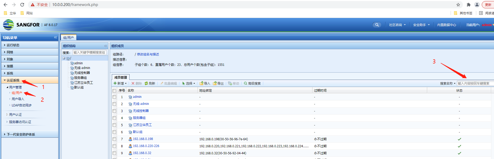

选择认证系统-选择组/用户-选择搜索名称-输入刚刚确定的大概IP地址，比如：输入192.168.2.158，然后搜索。 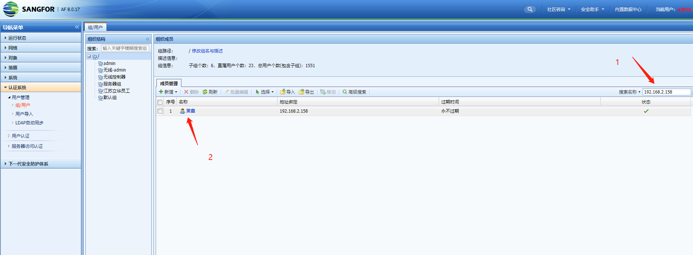

如果有返回的用户信息说明目前这个IP地址已经被分配，继续去找下一个可用的IP地址。 例如： 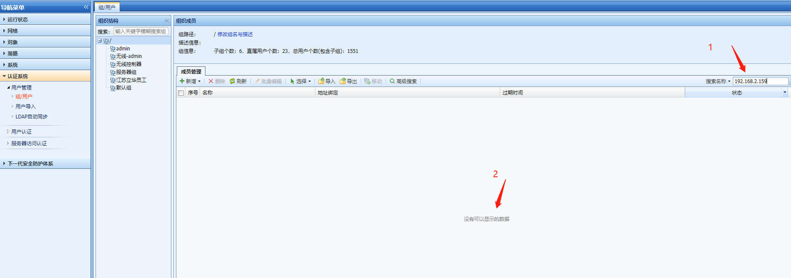

像这样说明在AF上没有配置用户，还不能确定是否真的没人使用，最好在核心交换机上通过“display arp all \| include 192.168.2.159”来继续查看是否有内网设备。 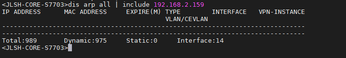

确定没有IP地址对应mac地址的ARP解析，那么这个地址可用。

## 三、IP地址配置

打开电脑控制面板，点击“更改适配器选项” 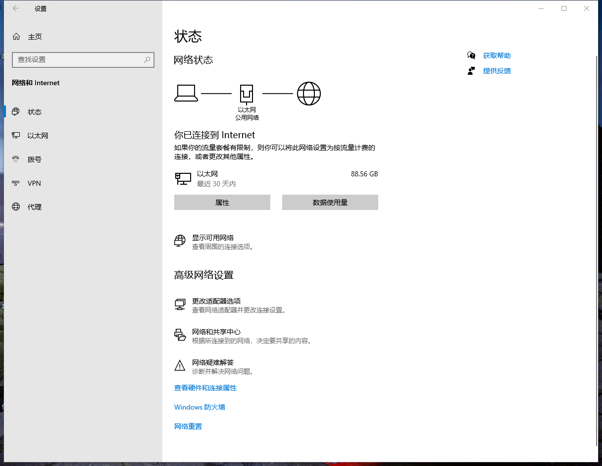

选择本机网卡 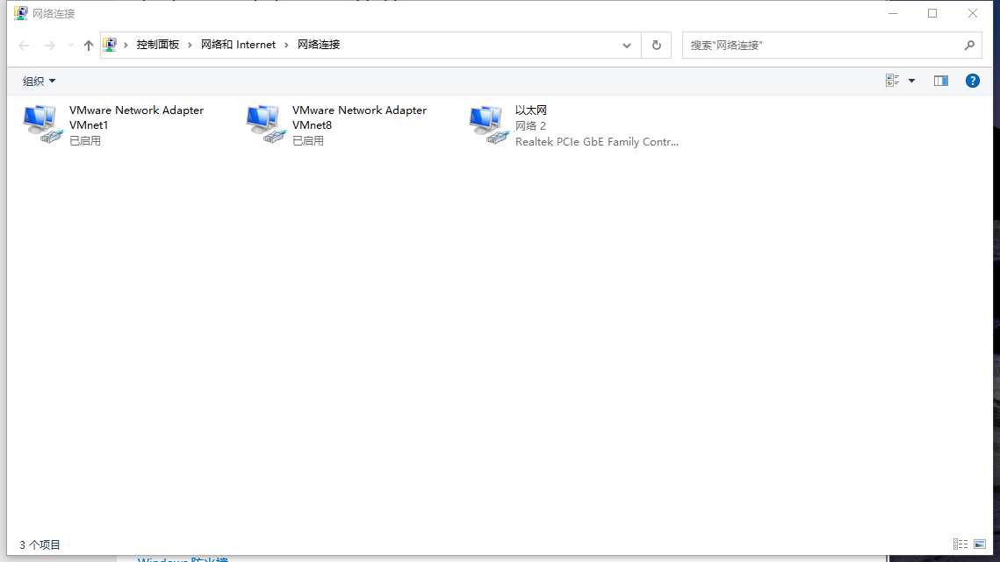

右击选择“属性”，进入之后再次选择“属性” 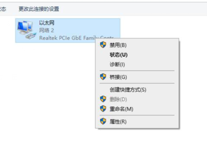 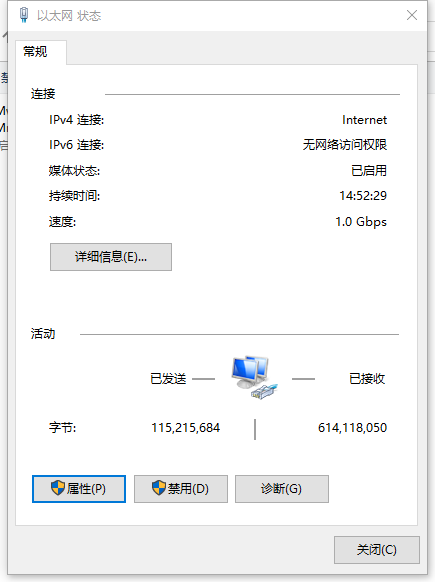

点击“Internet 协议版本4（TCP/IP）”，点击“属性” 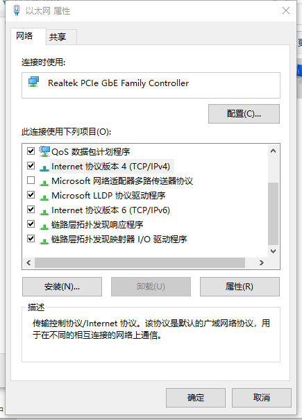

点击“使用下面的IP地址“，进行手动配置IP地址 

填写好在之前步骤中确认好的IP地址，例如：192.168.2.159 并填写好网关，DNS 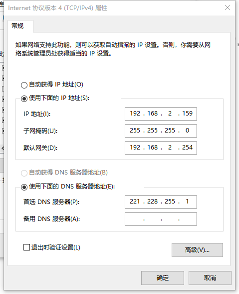

点击“确认“，即可完成配置 最后可以在搜索框中输入“cmd“：调出命令框进行验证，0丢失表示设置成功，或者打开浏览器查看是否可以打开网页，如果可以即配置成功 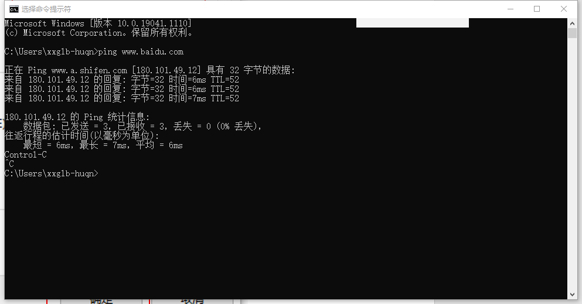

