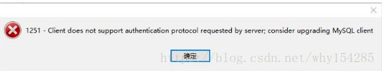

# navicat连接虚拟机MySQL报错

当我们在使用navicat进行远程连接到虚拟机的mysql数据库时，有时候会报这个错误。

通过查看网上别人遇到的相关问题，发现是由于navicat版本的问题，出现连接失败的原因：mysql8 之前的版本中加密规则是mysql\_native\_password,而在mysql8之后,加密规则是caching\_sha2\_password。并提供了两种解决方案

1.升级navicat，由于navicat是收费的，个人感觉升级会比较麻烦点。

2.把用户密码登录的加密规则还原成mysql\_native\_password这种加密方式，本人选择第二种解决方案 

\#输入命令修改相关机密方法

ALTER USER 'root'@'localhost' IDENTIFIED BY 'password' PASSWORD EXPIRE NEVER;这里的password是你正在使用的密码

ALTER USER 'root'@'localhost' IDENTIFIED WITH mysql\_native\_password BY 'password';\#更新一下用户的密码这里的password为你修改的新密码。

FLUSH PRIVILEGES; \#刷新权限，使自己的修改生效。

这时还是连接不上，然后通过telnet3306数据库对应的接口，出现了8.0.11;S"3&lt;VN,.Y\k4Ycaching\_sha2\_password这个信息，是修改没有生效还是其他原因？重启容器之后还是不行。

然后use mysql;

查询表中的相关信息 select user,host,plugin from user where user='root';

这时发现了问题，原理刚刚修改的是localhost，对于非本机的连接密码校验规则还是没有变。

alter user 'root'@'%' identified by 'password' password expire never;

alter user 'root'@'%' identified with mysql\_native\_password by 'why';//why是自己新修改的密码。root是用户，这个是修改密码的操作

flush privileges;再次刷新一下权限配置。

为了确定下，重新查一下，select user,host,plugin from user where user='root'; 

